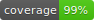
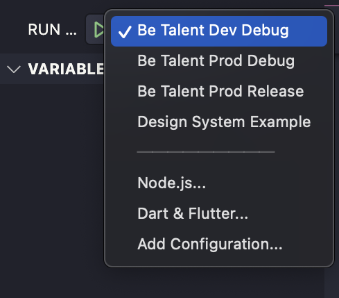

# 🌟 **BE Talent** 🌟

*Este repositório contém os aplicativos desenvolvidos para o desafio proposto para a vaga de Desenvolvedor Flutter na Be Talent.*

## Demo

Veja o aplicativo em ação!


## Sumário

- [Sobre o Projeto](#sobre-o-projeto)
- [Clonando o Repositório](#clonando-o-repositório)
- [Baixando as Dependências](#baixando-as-dependências)
- [Executando os Projetos](#executando-os-projetos)
- [Melhorias e Ajustes Futuros](#melhorias-e-ajustes-futuros)

---

### [Sobre o Projeto](#sobre-o-projeto) 

Este projeto foi desenvolvido utilizando a última versão do **Flutter** e **Dart** (3.29/3.7) disponível no momento de sua criação. Com a introdução das novas funcionalidades de **workspaces** no Dart, optei por criar um **monorepo**, que possibilita uma melhor organização dos projetos e pacotes.

Para manter uma estrutura modular e reutilizável, criei o pacote `design_system`, que contém as definições de cores, tipografia, componentes e outras diretrizes que estavam presentes no arquivo de 🌈 **Figma** fornecido. 

Dentro da pasta `apps/`, temos:

- **App de Exemplo**: Um app para visualizar todos os componentes definidos no `design_system`.
- **Be Talent**: O aplicativo principal proposto no desafio.

💡 **Arquitetura**:  
Adotei a nova arquitetura **MVVM** recomendada pelo time Flutter, com **Cubit** para gerenciar o estado da aplicação. A arquitetura é composta por:

- **View**: Onde a UI é construída.
- **ViewModel (Cubit)**: Onde a lógica de controle de estado acontece.
- **Repository**: Responsável por fazer as chamadas aos serviços externos.
- **Service**: Realiza a comunicação com APIs ou outros serviços.

### 🛠️ **Flavors e Features**  
Utilizei **Flavors** para alternar entre ambientes `dev` e `prod` e segui a estratégia de **Feature First** para organização das funcionalidades. Com isso, é possível testar diferentes versões e ambientes com facilidade.

### ✅ **Testes Unitários**  
Para garantir a qualidade do código, realizei testes unitários com **Mockito** e cobri todos os cenários de sucesso e falhas, alcançando uma **cobertura de 99%** de testes. 🔥

---


### [Clonando o Repositório](#clonando-o-repositório)

Clone o repositório para o seu computador com o seguinte comando:

```bash
git clone https://github.com/steniooliv/be_talent
```
---

### [Baixando as Dependências](#baixando-as-dependências)

Devido a um problema com o recurso de Workspaces no Dart, criei um script que irá baixar as dependências de todos os projetos automaticamente. Para isso, basta executar o seguinte comando:

```bash
./script.sh
```
Se preferir, você pode baixar as dependências manualmente em cada subpasta contendo um `pubspec.yaml` executando `flutter pub get`.

---

### [Executando os Projetos](#executando-os-projetos)

1. Pré-requisitos:

Certifique-se de que o Flutter está instalado corretamente e que você tem um emulador ou dispositivo físico configurado. Caso contrário, siga o [guia de instalação]('https://docs.flutter.dev/get-started/install').

2. Abrir o Projeto:

Abra o repositório no seu editor de código, como o VSCode.

3. Executar os Apps:

Na barra lateral de Run and Debug, você verá 4 opções de execução:



  - Be Talent: O app principal do desafio.
  - Design System Example: Um app de exemplo para testar todos os componentes do design system.

4. Depois de selecionar o app, clique em Run e veja a magia acontecer! ✨

---

### [Melhorias e Ajustes Futuros](#melhorias-e-ajustes-futuros)

Como em todo projeto, sempre há espaço para melhorias! Aqui estão algumas áreas que poderiam ser aprimoradas:

1. Melhoria no Gerenciamento de Workspaces:
Atualmente, há um problema com o Dart e os workspaces ao gerenciar dependências em repositórios monorepo. Idealmente, ao rodar flutter pub get, todas as dependências deveriam ser centralizadas em uma pasta na raiz do repositório. Para acompanhar a issue no GitHub, clique aqui.

2. Fontes no iOS:
Durante o desenvolvimento, encontrei um problema com o peso da fonte (weight) da Helvetica no iOS. Ele funcionava bem no Android, mas o iOS não aplicava o peso corretamente. Após abrir uma issue no GitHub, descobri que este problema também afeta fontes nativas em Chinês e Japonês. Para resolver isso, fiz um ajuste na importação do asset da fonte, garantindo que o iOS reconhecesse corretamente o peso. Para acompanhar a issue, clique aqui.

---

### Conclusão

Este projeto foi uma ótima oportunidade para explorar as novas funcionalidades do Flutter, como workspaces e Cubit para gerenciamento de estado, além de proporcionar uma ótima base para futuras melhorias e inovações. 🏆